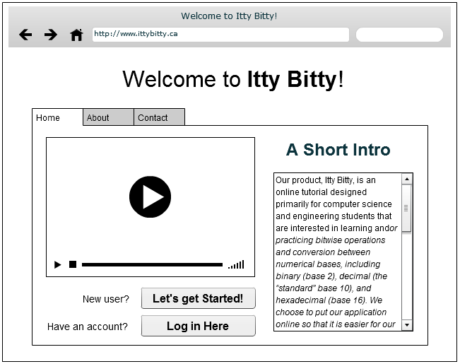
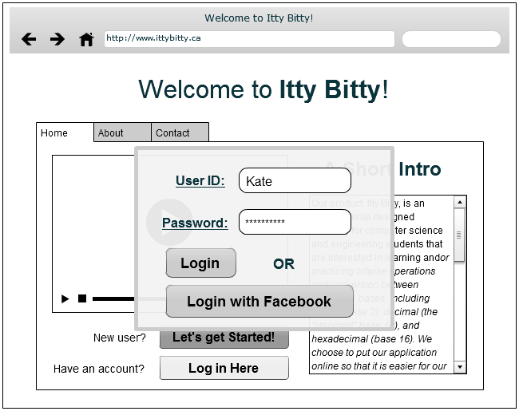
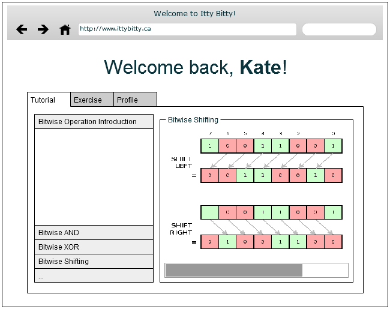
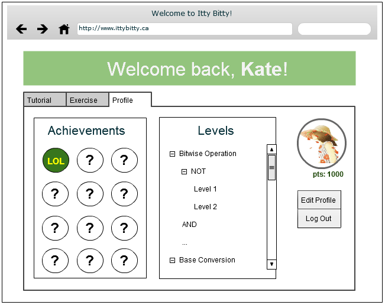

CSC301 Phase 1
==============

### Team Introduction

##### Group photo

*Left to right: Christina Chen, Sharon Hogan, Cindy Wu, Ben Shaft, Eric Snyder, Eugene Cheung, Inks Lin, Catherine Wang*

##### Ben Shaft
Like my teammates, I am currently in my third year of study at the University of Toronto pursuing a Computer Science Specialist degree. My focuses are Computer Systems and Artificial Intelligence. From a young age, I knew I was attached to computers so it was only a matter of time before I learnt how to code in 2010 and later began my path as a Computer Scientist at UofT. Outside of school I have attended hackathons to test my coding skills in a short time span. Essentially, [CS is my life](https://www.youtube.com/watch?v=UF4ReqcJAFM).

Fun Fact: There exists a hologram of me popping a water balloon. Unfortunately it is not in my possession.

##### Catherine Wang
I am a third-year student at University of Toronto St. George in Computer Science Specialist Program, with focuses on Game Design and Web and Internet Technology. I started programming when I took CSC108, but I found myself having great interest in Computer Science. I have been passionate about technologies since I was in elementary school, but I never got a chance to dig into technology until I entered Computer Science. I did summer research with Professor Steve Engels about Science games in 2014. My career plan is to get into the Software Engineering industry and develop innovative software.

##### Christina Chen
I am a third-year student at University of Toronto St. George, with a double major in computer science and biology. I first started programming in high school by self-studying Java in a (failed) attempt to take as many AP exams as possible, but didn’t seriously consider it as a career until I took CSC108 as a “bird” course at the end of first year. I’m currently a bioinformatics research assistant at the [Chang Lab](http://labs.eeb.utoronto.ca/chang/), where I work with various algorithms to sequence genetic material more efficiently.

##### Cindy Wu
I am a third-year student at University of Toronto St. George studying for a Bachelor of Science computer science specialist, statistics major, and math minor with focus in artificial intelligence. I started programming in grade 10 when I took our high school’s Introduction to Computer Science class where we learned Java. I enjoy creating things for functionality and to simplify things as much as possible. To me, finding ways to change and adapt based on experiences is very important.

##### Eric Snyder
While I would like to say I am a UofT graduate, the fact I'm currently taking this course kind of implies I'm not. To quote the other 7 members of my group, "I am a third-year student at University of Toronto St. George pursuing a Bachelor of Science" (or some other permutation of those words that everyone else started their introduction with). However, unlike the other members of my group the focus of my specialist is in Computer Systems. Most of my personal projects that I've worked on have been related to videogames and AI/Computer Vision, but I'm not particularly interested in pursuing either of those fields with my degree post-graduation, I just haven't had any fun ideas for system-related projects to work on until my most recent project, working on emulating a video game console on a windows PC (though still technically related to video games, I guess). Most of my skills lie in C/C++ and similar languages, and I’ve also had experience with writing compilers. As a Kendoka, my Samurai honour dictates I must get a 4.0 in this course, otherwise I'll be forced to commit seppuku.

##### Eugene Cheung
I am a third-year student at University of Toronto St. George studying to get a Bachelor of Science with a specialization in Computer Science and a focus in Web and Internet technologies. I began teaching myself about graphic design and basic programming at the age of 12, and have loved crafting beautiful creations ever since. My passion for computer science was further fueled by taking introductory classes in secondary school. I have participated in several hackathons as part of [Team Unhaltable](http://www.unhaltable.com/) and was part of the winning team at UofTHacks 2013. I have worked on the [MarkUs Project](http://markusproject.org/) in the past and will be interning at [Infusion](http://www.infusion.com/) starting in May. I was a teaching assistant (Android specialist) for CSC207 last semester and am currently a teaching assistant for CSC318.

##### Yining (Inks) Lin
I am a third year student at University of Toronto, studying for Computer Science Specialist, focus in AI and Game Design. I had a dream to become a professional Counter Strike player when I was a kid. Due to reality and its name, I chose Computer Science as my major field of study in university. The only related experience I had was Python programming where I learn from  my high school CS courses. It is fun to study how computer and software works. Honestly, I am bad at algorithm and okay at programming. Thus it is my pleasure to join in this awesome team and having a chance to make something cool. In addition, I can do what I learned from required curriculums, including web programming (309), databases (343) and Django.

##### Sharon Hogan
I am in my third year at University of Toronto, aiming to complete both a computer science specialist and a statistics major. My current fields of interests are machine learning and web development. I currently work on the [Hero Games website](herogames.ca). The first programming language I learned was Turing back in grade 9 and I really enjoyed it, but it wasn't until grade 12 that I finally decided I would want to pursue this as a career. So here I am, three years later taking CSC301 at University of Toronto.

### Project

Itty Bitty is an interactive web-based tutorial that allows users to learn about and practice bitwise operators/arithmetic, and conversion between numerical bases (decimal, binary, and hexadecimal). This topic was chosen by the group by collectively eliminating topics from a list of various computer science-related topics our group found difficult or interesting throughout our experiences in classes. Ideas that were too obscure (such as Verilog) or already overdone (such as data structures) were easily rejected. The particular concept behind Itty Bitty stemmed from our experiences with courses such as CSC258 and CSC369, where an understanding of bitwise operations and converting between different numerical bases comes in useful. For example, knowledge of manipulating bits and converting from hexadecimal to decimal is helpful for reading and modifying with file systems. The Itty Bitty system is targeted not only at university-level computer science students, but anybody who is interested in learning about these topics, such as secondary school students interested in entering fields such as computer science or computer engineering, designed in such a way that anybody can begin learning about these topics with no prior knowledge. Of course, users can also skip to specific “lessons” that they are more interested in.

### Personas

**Jamming Jim** is a fairly laidback 18 year old senior high school student in Toronto interested in studying computer science in university, which stems from having taken an introductory course in the previous year and enjoys being able to solve problems through code. He enjoys playing guitar and is part of an indie band with his friends, occasionally playing small gigs at local bars. Since he considers himself to be a fairly average student, Jim is preparing himself for university by using various online tools to learn more related content alongside his high school courses. Alongside more school-like resources such as Coursera or Udemy, Jim enjoys learning about new things through interactive websites such as Itty Bitty, which allows him to learn about bitwise operations and conversion between numerical bases (such as binary, decimal, and hexadecimal), despite having no prior knowledge in these specific topics. While he generally doesn’t enjoy classes, Jim thinks online learning tools work fairly well and he can firmly grasp the material by being more hands-on with the tutorials. As such, he thinks he can improve his grades in high school and do well in post-secondary school, with high hopes for the future.

**Studious Sarah** is a third year university student attending University of Texas at Austin. Sarah commutes to and from school every day. Asides from studying computer science for school, Sarah also plays baseball on the varsity team. On the commute to school, Sarah uses her iPad to catch up on schoolwork and study. Sarah is currently taking a course on C programming and operating systems, and is given an assignment about file systems that requires the use of bitwise operations and conversion between binary, decimal, and hexadecimal bases. Having missed a few days of school due to baseball practice and games, Sarah was absent when the class covered bitwise operations and is responsible for learning the material on her own time. She discovers the website Itty Bitty, which allows her to learn as well as practice these concepts on her commute to and from school, so she has the knowledge required to complete the assignment at home. She thinks an interactive tutorial is more engaging and allows her to absorb the material more easily than reading a textbook. Being able to catch up during the commute saves time for Sarah, who can then use the time to work on other assignments as well as spend it practicing more baseball.

**Professor Oak** is an instructor for a introductory hardware course at Smogon University. Part of the curriculum includes low-level machine languages, which makes heavy use of bitwise operations as well as conversion between binary and other bases. Many students in the class struggle with the concept in lectures, and Oak has noticed that the textbook does not cover it in great detail. In order to help his students get a better understanding of bitwise operators and bases, Oak searches online for a source to help explain the concepts differently. He finds Itty Bitty, a website that not only teaches bitwise operators and base conversion in a way that is engaging and easy for beginners to understand, it allows people to get hands-on practice and feedback from the exercises instantly. Oak hopes to use Itty Bitty as supplementary material in his class, as a way for students to visualize bitwise operations and binary arithmetic more easily than just reading a textbook or lecture slides as well as get additional practice for the concepts.

### User Stories

Priority scale:
- 1: vital feature, must be in MVP
- 2: important feature, but can be included in a later release
- 3: nice feature that can be put off until even later

As Jim, I want to learn more through **interactive online tutorials** via a truly hands-on approach with the actual material so I can learn more about the things I’m interested in. (1)

As Sarah, I want to be able keep up with **school material in an approachable and engaging manner** so I can continue to participate in competitive sports without sacrificing my GPA. (1)

As Jim, I would like to be able to **register and login quickly** by connecting to my **existing social network accounts**, such as Facebook or Twitter. (2)

As Sarah, I want to learn how to quickly **convert between numerical bases** (decimal, binary, and hexadecimal) so that I can naturally do so and be able to more efficiently do my schoolwork. (1)

As Jim, I want to **learn about and practice using bitwise operators** so that I don’t have to keep using trial and error to achieve what I want to do. (1)

As Jim, I enjoy playing video games and like the “gamified” aspect of Itty Bitty with its **achievements, levels, and points system**, which encourages me to play/learn more. (2)

As Sarah, I like being able to **pick up from where I left off** by being able to login to Itty Bitty and immediately being able to see which levels I have completed and which I have yet to do. (3)

As Sarah, I want to have a **quick overview of the bitwise operators** for a quick review as I work on an assignment. (2)

### MVP

Our product, **Itty Bitty**, is an online tutorial designed primarily for computer science and engineering students that are interested in learning and/or practicing bitwise operations and conversion between numerical bases, including binary (base 2), decimal (the “standard” base 10), and hexadecimal (base 16). For the more experienced users, we allow users to skip unnecessary tutorials via a practice option. We choose to put our application online so that it is easier for our users to access from any device, anywhere they happen to be with reinforcing ternet access. Our product features a game-like atmosphere with an interactive way of reinforcing users’ knowledge of the concepts to reduce the traditionally dull tutorial/lesson feeling. For example, Itty Bitty will feature levels, achievements, leaderboards and the ability to connect via and share to social network accounts. We will also make sure our application contains a multitude of images or animations to make this product visually appealing and easy for users to learn. To expand on learning bitwise operations and conversion between numerical bases, the topics will be combined so that users can learn how to perform simple arithmetic with numbers of differing bases. These topics are fundamental and provide a solid foundation to many computer science courses in post-secondary education.

### Release and Iteration Planning

Features that we will be excluding from the first release include user accounts and associated features such as achievements, points, saved level state, and registration/login via social networks such as Facebook, Twitter, or Google+. Due to the timeframe of the first release (3 weeks), we will be primarily focusing on the more vital core features necessary for creating Itty Bitty, such as the actual tutorial system.

For the first release, we will be setting up a basic web app using [Sails.js](http://sailsjs.org/) and planning out a proper database schema. A tutorial system that can display information to users and accept and validate user input as the base for a game-like level system will then be worked on. In the first iteration, tutorial content will be drafted and work on the system for displaying content and accepting/validating user input will be started. For the rest of the time allotted for working on the first release, these features will be improved and some preliminary work will be done for non-vital features such as users, achievements, and points, but will only be done as “scaffolding” for future work.

### CRC Cards

### Appendix

#### Google Docs

[Original Google Docs document](https://docs.google.com/document/d/18lOGGR3R4PVwNT7WyQkcD0-scaZqgcGaGy09wHoSBSo/edit), where this was collaboratively edited by the group.

#### Low-fidelity UI mockups:

